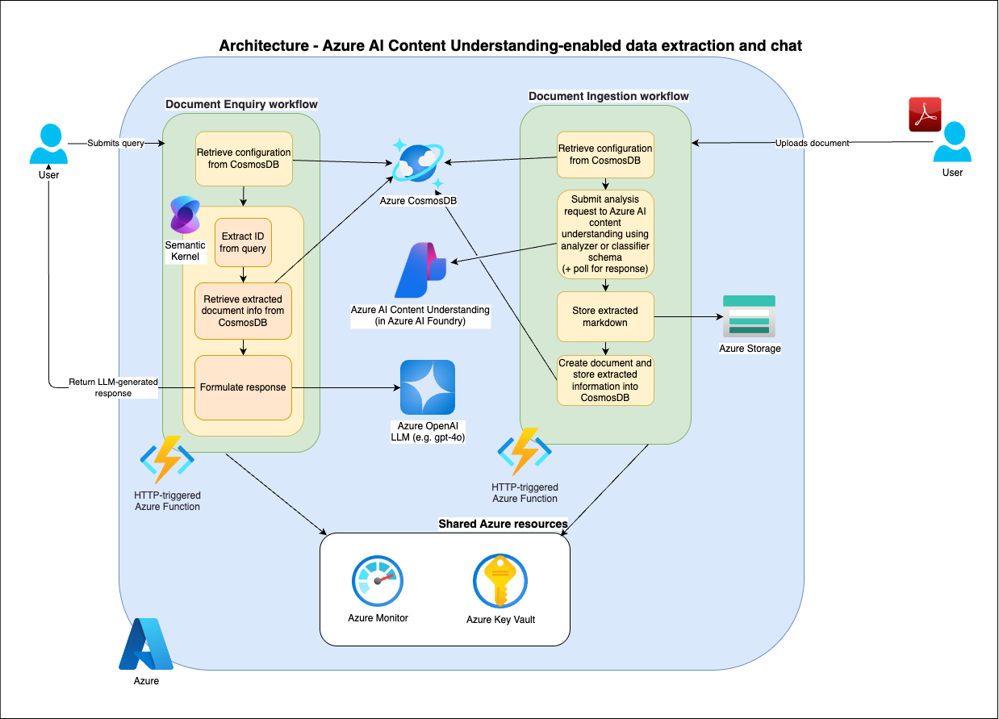

# Data Extraction using Azure Content Understanding

[](https://codespaces.new/Azure-Samples/data-extraction-using-azure-content-understanding)
[](https://vscode.dev/redirect?url=vscode://ms-vscode-remote.remote-containers/cloneInVolume?url=https://github.com/Azure-Samples/data-extraction-using-azure-content-understanding)
[](https://shell.azure.com/)

This sample demonstrates how to build an intelligent document processing solution using Azure Content Understanding to extract structured data from documents and provide conversational querying capabilities.

> **Note**: This sample is for demonstration purposes and should be adapted for production use with appropriate security, monitoring, and error handling considerations.

## 🚀 Features

- **Document Ingestion**: Automatically process documents using Azure Content Understanding to extract structured data
- **Configurable Extraction**: Define custom field schemas and extraction rules via JSON configuration
- **Conversational Interface**: Query processed documents using natural language powered by Azure OpenAI
- **Scalable Architecture**: Built on Azure Functions for serverless, event-driven processing
- **Document Classification**: Intelligent document type classification and routing
- **Data Storage**: Persistent storage with Azure Cosmos DB for extracted data
- **Infrastructure as Code**: Complete Terraform deployment for reproducible infrastructure

## 📋 Prerequisites

- Azure subscription with access to:
  - Azure Content Understanding
  - Azure OpenAI Service
  - Azure Functions
  - Azure Cosmos DB
  - Azure Key Vault
  - Azure Storage Account
- Python 3.12 or later
- Terraform (for infrastructure deployment)
- Azure CLI

## 🏗️ Architecture

The solution implements three main workflows:

1. **Document Enquiry**: Natural language querying of processed documents using Azure OpenAI
2. **Configuration Upload**: Management of document extraction schemas and rules
3. **Document Ingestion**: Automated processing of documents with Azure Content Understanding



For detailed architecture information, see [Architecture Documentation](./docs/architecture.md).

## 🚀 Quick Start

### Option 1: Deploy to Azure (Recommended)

**One-Click Deployment:**
1. Click the "Deploy to Azure" button above to open Azure Cloud Shell
2. Run the following command for automated deployment:

```bash
curl -s https://raw.githubusercontent.com/Azure-Samples/data-extraction-using-azure-content-understanding/main/deploy.sh | bash
```

**Manual Deployment:**
1. Click the "Deploy to Azure" button above to open Azure Cloud Shell
2. Run the following commands in the Cloud Shell:

```bash
# Clone the repository
git clone https://github.com/Azure-Samples/data-extraction-using-azure-content-understanding.git
cd data-extraction-using-azure-content-understanding/iac

# Copy and configure the terraform variables
cp terraform.tfvars.sample terraform.tfvars

# Edit the terraform.tfvars file with your desired values
# You can use the Cloud Shell editor: code terraform.tfvars

# Initialize and deploy the infrastructure
terraform init
terraform plan
terraform apply -auto-approve
```

### Option 2: GitHub Codespaces

1. Click the "Open in GitHub Codespaces" button above
2. Wait for the codespace to be created and configured
3. Follow the setup instructions in the terminal

### Option 3: Dev Container

1. Clone this repository
2. Open in VS Code
3. When prompted, reopen in Dev Container
4. The container will automatically install all dependencies

### Option 4: Local Development

1. Clone the repository:

```bash
git clone https://github.com/Azure-Samples/data-extraction-using-azure-content-understanding.git
cd data-extraction-using-azure-content-understanding
```

1. Create a virtual environment:

```bash
python -m venv .venv
source ./.venv/Scripts/activate  # or ./.venv/bin/activate if on Mac/Linux
```

1. Configure VS Code settings:

Add the following property in `.vscode/settings.json`:

```json
"azureFunctions.pythonVenv": ".venv"
```

1. Install dependencies:

```bash
pip install -r requirements.txt
```

1. Configure environment variables:

```bash
cp src/local.settings.sample.json src/local.settings.json
# Edit local.settings.json with your Azure service configurations
```

## 🛠️ Setup and Configuration

### 1. Deploy Infrastructure

First, authenticate with Azure and ensure you're using the correct subscription:

```bash
az login

# List available subscriptions
az account list --output table

# Set the correct subscription
az account set --subscription "your-subscription-id"

# Verify the selected subscription
az account show --output table
```

Navigate to the `iac` folder and deploy the required Azure resources:

```bash
cd iac
cp terraform.tfvars.sample terraform.tfvars
# Edit terraform.tfvars with your values
terraform init
terraform plan
terraform apply
```

Note that the provided Terraform scripts will by default create the appropriate roles for access for the user principal running the script;
you will need to grant permissions to other users for accessing the Key Vault and CosmosDB instances:

Get their user principal ID - they will have to run:

```bash
az cli login
az ad signed-in-user show --query id -o tsv
```

Then, you can run:

```sh
az role assignment create \
--assignee "<their-user-principal-id>" \
--role "DocumentDB Account Contributor" \
--scope "/subscriptions/<subscription-id>/resourceGroups/<resource-group-name>/providers/Microsoft.DocumentDB/databaseAccounts/<cosmosdb-name>"
 
az cosmosdb sql role assignment create \
  --account-name "devdatext8wucosmoskb0" \
  --resource-group "devdatext8WuRg0" \
  --role-definition-id "00000000-0000-0000-0000-000000000001" \
  --principal-id "<their-user-principal-id>" \
  --scope "/subscriptions/<subscription-id>/resourceGroups/<resource-group-name>/providers/Microsoft.DocumentDB/databaseAccounts/<cosmosdb-name>"
```

### 2. Configure Application Settings

Update the `src/local.settings.json` file:

```json
{
  "IsEncrypted": false,
  "Values": {
    "AzureWebJobsStorage": "<your-storage-connection-string>",
    "FUNCTIONS_WORKER_RUNTIME": "python",
    "ENVIRONMENT": "local"
  }
}
```

If you want to test the out-of-the-box monitoring integration with Application Insights and enable tracing of the Semantic Kernel workflow in the query endpoint, add the following:

```json
{
  ...
  "Values": {
    ...
    "SEMANTICKERNEL_EXPERIMENTAL_GENAI_ENABLE_OTEL_DIAGNOSTICS": true,
    "APPLICATIONINSIGHTS_CONNECTION_STRING": "<CONNECTION_STRING>"
  }
}
```

You can add `"SEMANTICKERNEL_EXPERIMENTAL_GENAI_ENABLE_OTEL_DIAGNOSTICS"` to the Function App  app settings to capture Semantic Kernel telemetry in the deployed environment;
if you would like to capture prompts/completions as part of that telemetry, include `"SEMANTICKERNEL_EXPERIMENTAL_GENAI_ENABLE_OTEL_DIAGNOSTICS_SENSITIVE": true` instead of the other SK environment variable.

### 3. Update Application Configuration

Update the `src/resources/app_config.yaml` file with your Azure service endpoints and keys/secrets from Key Vault for the respective environment (specified in your `ENVIRONMENT` environment variable):

```yaml
# Example configuration - update with your actual values
azure_content_understanding:
  endpoint: "<your-content-understanding-endpoint>"
  subscription_key: "<your-content-understanding-key>"
  
azure_openai:
  endpoint: "<your-openai-endpoint>"
  api_key: "<your-openai-api-key>"
  
cosmos_db:
  connection_string: "<your-cosmosdb-connection-string>"
  
key_vault:
  url: "<your-key-vault-url>"
```

Note that the `app_config.yaml` file should NOT directly contain any secrets, only the names of the secrets as stored in Key Vault, as this file is tracked under version control.

### 4. Upload Configuration

Create and upload document extraction configurations:

```bash
# Example configuration upload
curl -X POST http://localhost:7071/api/v1/ingest/config \
  -H "Content-Type: application/json" \
  -d @configs/document-extraction-v1.0.json
```

## 📖 Usage

### Running the Application

1. **Start the Function App**:
   ```bash
   func start --script-root ./src/
   ```

2. **Test Health Check**:
   ```bash
   curl http://localhost:7071/api/v1/health
   ```

   **Expected Healthy Response**:
   
   When all resources and their connectivity are healthy, the health check will return:
   ```json
   {
     "status": "healthy",
     "checks": {
       "mongo_db": {
         "status": "healthy",
         "details": "mongo_db is running as expected."
       },
       "cosmos_db": {
         "status": "healthy",
         "details": "cosmos_db is running as expected."
       },
       "key_vault": {
         "status": "healthy",
         "details": "key_vault is running as expected."
       },
       "content_understanding": {
         "status": "healthy",
         "details": "content_understanding is running as expected."
       },
       "azure_openai": {
         "status": "healthy",
         "details": "azure_openai is running as expected."
       }
     }
   }
   ```

### Document Processing

1. **Upload Documents**: Place documents in the configured Azure Storage container
2. **Monitor Processing**: Check Azure Function logs for processing status
3. **Query Results**: Use the inference API to query processed documents

### Sample HTTP Requests

The `src/samples/` directory contains sample HTTP requests for:
- Health checks (`health_check_sample.http`)
- Configuration management (`config_update_sample.http`)
- Document querying (`query_api_sample.http`)
- Classifier management (`classifier_management_sample.http`)

## 🧪 Testing

Run the test suite:

```bash
# Install test dependencies
pip install -r requirements_dev.txt

# Run tests
pytest
```

## 📁 Project Structure

```
├── configs/                    # Sample configuration files
├── docs/                      # Documentation and architecture diagrams
├── iac/                       # Terraform infrastructure as code
│   └── modules/              # Reusable Terraform modules
├── src/                       # Source code
│   ├── configs/              # Application configuration management
│   ├── controllers/          # API controllers
│   ├── decorators/           # Custom decorators
│   ├── models/               # Data models
│   ├── routes/               # API routes
│   ├── samples/              # Sample HTTP requests
│   ├── services/             # Business logic services
│   └── utils/                # Utility functions
└── tests/                     # Unit and integration tests
```

## 🔧 Configuration

### Document Extraction Configuration

Define extraction schemas in JSON format:

```json
{
  "id": "document-extraction-v1.0",
  "name": "document-extraction",
  "version": "v1.0",
  "collection_rows": [
    {
      "data_type": "LeaseAgreement",
      "field_schema": [
        {
          "name": "monthly_rent",
          "type": "integer",
          "description": "Monthly rent amount",
          "method": "extract"
        }
      ],
      "analyzer_id": "lease-analyzer"
    }
  ]
}
```

### Environment Variables

Key environment variables for configuration:

- `AZURE_CONTENT_UNDERSTANDING_ENDPOINT`: Azure Document Intelligence endpoint
- `AZURE_CONTENT_UNDERSTANDING_KEY`: Azure Document Intelligence key
- `AZURE_OPENAI_ENDPOINT`: Azure OpenAI service endpoint
- `AZURE_OPENAI_API_KEY`: Azure OpenAI API key
- `COSMOS_DB_CONNECTION_STRING`: Cosmos DB connection string

## 🤝 Contributing

This project welcomes contributions and suggestions. Most contributions require you to agree to a Contributor License Agreement (CLA) declaring that you have the right to, and actually do, grant us the rights to use your contribution.

When you submit a pull request, a CLA bot will automatically determine whether you need to provide a CLA and decorate the PR appropriately (e.g., status check, comment). Simply follow the instructions provided by the bot.

## 📄 License

This project is licensed under the MIT License - see the [LICENSE](LICENSE) file for details.

## 🆘 Support

For support and questions:

- Create an issue in this repository

## 🔗 Related Resources

- [Azure Content Understanding documentation](https://learn.microsoft.com/en-us/azure/ai-services/content-understanding/)
- [Azure OpenAI Service Documentation](https://docs.microsoft.com/azure/cognitive-services/openai/)
- [Azure Functions Python Developer Guide](https://docs.microsoft.com/azure/azure-functions/functions-reference-python)
- [Azure Cosmos DB Documentation](https://docs.microsoft.com/azure/cosmos-db/)
