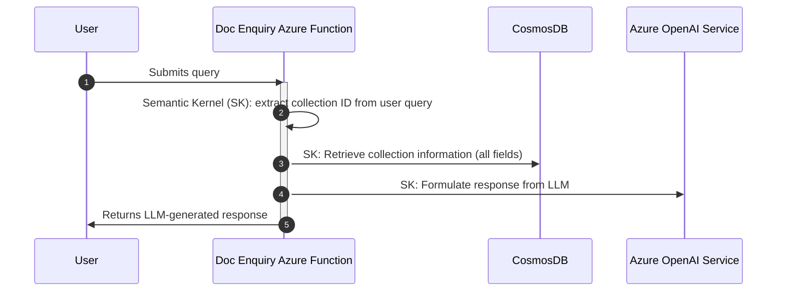
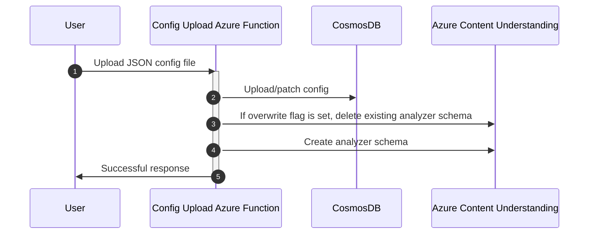
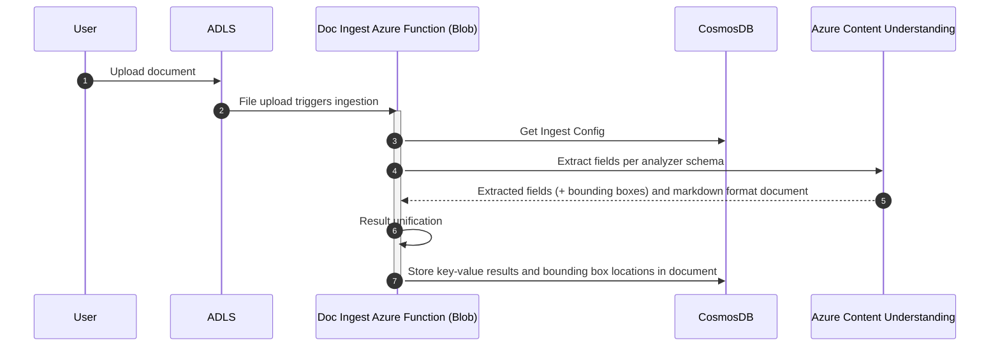

# System architecture <!-- omit in toc -->

- [Proposed system architecture](#proposed-system-architecture)
- [Document enquiry workflow](#document-enquiry-workflow)
- [Configuration upload workflow](#configuration-upload-workflow)
  - [Sample configuration](#sample-configuration)
- [Document Ingestion Workflows](#document-ingestion-workflows)
  - [Document Ingestion Flow - new document added](#document-ingestion-flow---new-document-added)
  - [Sample document extraction results](#sample-document-extraction-results)

## Proposed system architecture


The overall architecture consists of three main workflows:

- **Document enquiry**: describes how the system will respond to end users asking questions about the ingested data by querying and aggregating data from CosmosDB, using an LLM-based conversational interface
- **Configuration upload**: describes the workflow for uploading JSON configurations for use at ingestion and inference time
- **Document ingestion**: describes the process by which raw documents will be processed using Azure AI Content Understanding to extract specified fields as structured data and stored to CosmosDB

See the sections below for a sequence diagram of each workflow, along with additional proposed implementation details.

## Document enquiry workflow



## Configuration upload workflow



Configurations will be versioned to facilitate experimentation.

### Sample configuration

The configuration will contain information that will be used at both ingestion and inference time.

A sample of the expected configuration format is shown below.

```json
{
    "id": "document-extraction-v1.0",
    "name": "Document Extraction Profile",
    "version": "1.0",
    "prompt": "You are a helpful assistant tasked with using the necessary tools to retrieve document information based on the collection ID provided by the user.",
    "collection_rows": [
      {
          "data_type": "LeaseAgreement",
          "field_schema": [
              {
                  "name": "monthly_rent",
                  "type": "integer",
                  "description": "Monthly rent",
                  "method": "extract"
              }
          ],
          "analyzer_id": "test-analyzer"
      }
    ],
    "extraction_config_hash": "<sha256-hash-of-extraction-configs>"
}
```

**NOTE(\*):** The extraction config hash is a SHA-256 hash computed from the set of document configurations for Azure AI Content Understanding. This hash uniquely identifies the extraction document configurations and helps detect changes or duplicates.

## Document Ingestion Workflows

The document ingestion process extracts structured data from raw documents, transforming unstructured content into a structured format suitable for querying and analysis. During ingestion, relevant fields and clauses are identified and extracted using configured analyzers. The extracted data is then persisted in Azure Cosmos DB. To ensure consistency and detect configuration changes, a SHA-256 hash is computed based on the configuration used during extraction. This hash allows the system to determine if the extraction configuration has changed, ensuring data consistency and integrity across ingestion runs.

When a new document is added, it will be processed using the default configuration associated with the system.

### Document Ingestion Flow - new document added



Assumptions:

- Each extracted document stored in Cosmos DB will be uniquely identified by a composite key structured as `{CollectionID}-{sha256-hash-of-extraction-config}`. The SHA-256 hash is computed based on the extraction configuration used, enabling detection of configuration changes and ensuring data consistency.
- Bounding box locations of all the extracted key-value pairs will be stored in Cosmos for traceability
- All extracted fields that contain non-null values will be explicitly stored in Cosmos DB, ensuring completeness and consistency of the structured data.
- Note that this flow does not include any kind of vectorization or vector DB - all lookups will involve documents keyed by the collection ID.
- This architecture is specifically designed to support workflows where questions are focused on a single collection. Multi-collection queries are not currently supported and will require additional design considerations for future implementation.

### Sample document extraction results

After receiving the response from Azure AI Content Understanding for a particular document, we will add it to the appropriate document in CosmosDB based on its collection ID and the distinct list of analyzers used.
This document will include the extracted fields (and bounding box locations of those fields in the document for traceability/future display purposes) as defined in the analyzer schema, along with some metadata to note the names and locations of the files associated with that collection.

A sample of the expected audit document format is shown below.

```json
{
  "id": "collection1-{hash(analyzer-block)}",
  "config-id": "audit-file-v1.0",
  "extraction-config-hash": "{hash(analyzer-block)}",
  "information": {
    "entities": [
      {
        "name": "lease 1",
        "original-documents": [
            "pdf1",
            "pdf2"
        ],
        "markdowns": [
          "collection1/lease1/markdown1.md",
          "collection1/lease1/amendment1.md"
        ],
        "fields": {
          "landlord": [
            {
              "document-type": "LeaseAgreement",
              "document": "lease pdf file",
              "markdown": "collection1/lease1/markdown1.md",
              "date-of-document": "2019-11-20",
              "type": "string",
              "valueString": "Microsoft",
              "spans": [
                {
                  "offset": 24149,
                  "length": 11
                }
              ],
              "confidence": 0.947,
              "source": "D(7,2.5659,10.0653,3.4144,10.0653,3.4144,10.2412,2.5659,10.2412)"
            }
          ],
          ...
        }
      },
      ...
    ]
  }
}
```
